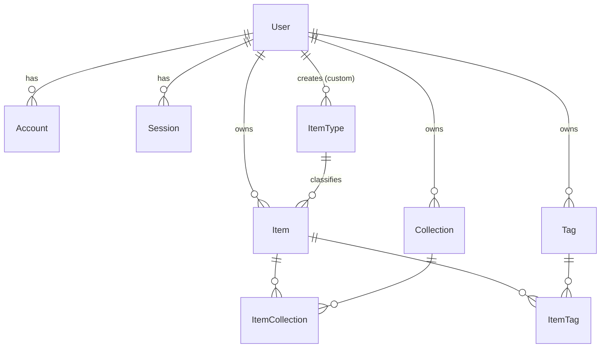
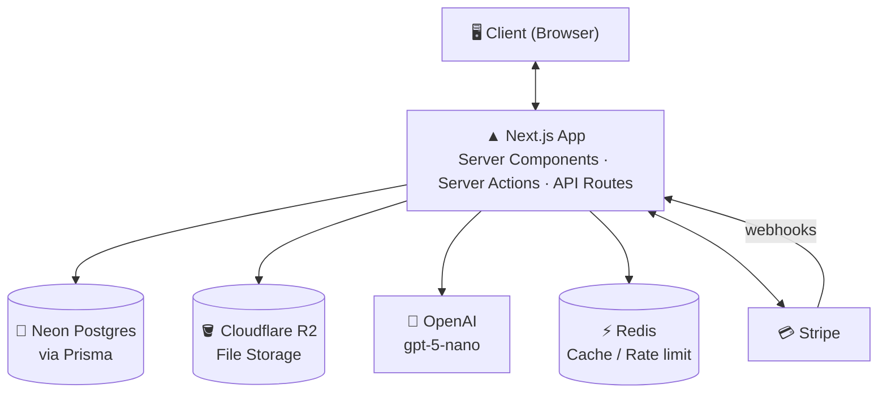
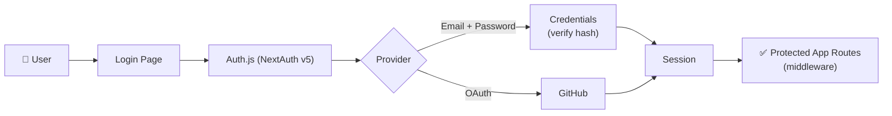
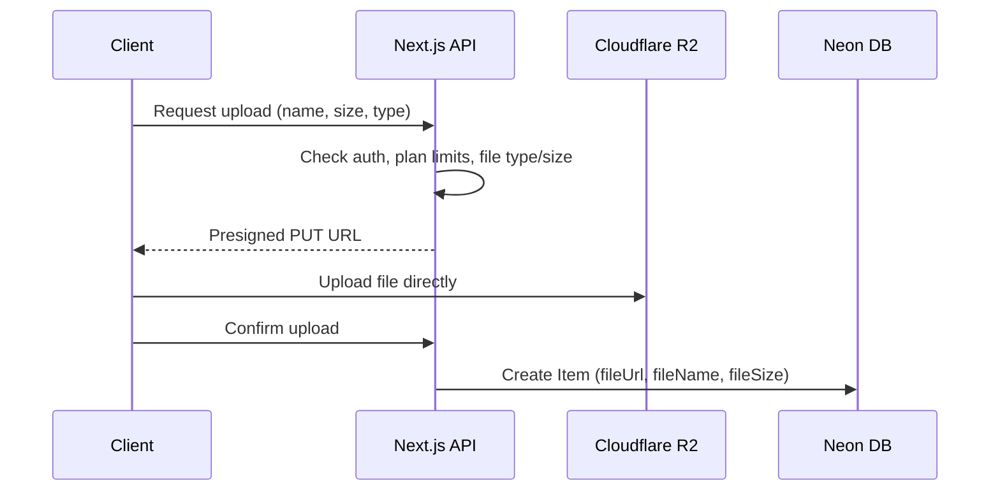
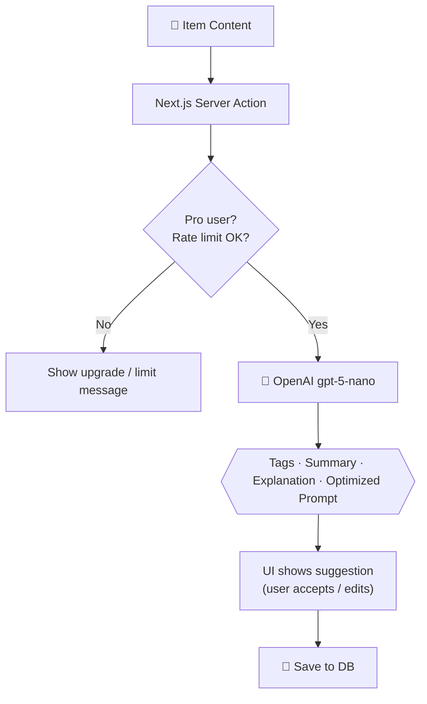
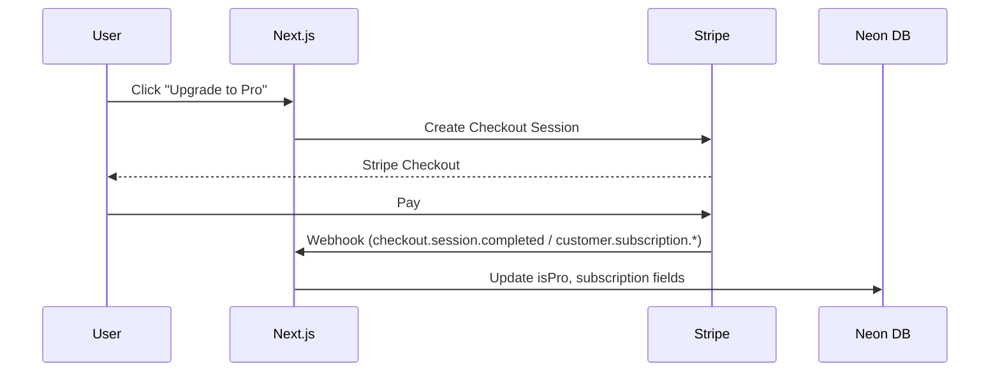

# 🗃️ DevStash — Project Overview

> 🚀 **A centralized developer knowledge hub** for code snippets, AI prompts, notes, commands, files, links and more.
>
> **Store Smarter. Build Faster.**

| | |
| --- | --- |
| **Status** | 📝 Planning → ready for environment setup & UI scaffolding |
| **Type** | SaaS (Free + Pro tiers) |
| **Stack** | Next.js · TypeScript · Neon Postgres · Prisma · Auth.js · Tailwind v4 · shadcn/ui · Cloudflare R2 · OpenAI · Stripe |

---

## 📑 Table of Contents

1. [Problem](#-problem)
2. [Target Users](#-target-users)
3. [Core Features](#-core-features)
4. [Item Types](#-item-types)
5. [Data Model (Prisma)](#️-data-model-prisma)
6. [Tech Stack](#-tech-stack)
7. [Architecture](#-architecture)
8. [Monetization](#-monetization)
9. [UI / UX](#-ui--ux)
10. [Development Workflow](#️-development-workflow)
11. [Roadmap](#-roadmap)
12. [Open Questions](#-open-questions)
13. [Useful Links](#-useful-links)

---

## 📌 Problem

Developers keep their essentials scattered across many tools:

| What | Where it usually lives |
| --- | --- |
| Code snippets | VS Code, Notion |
| AI prompts | Buried in chat histories |
| Context files | Hidden inside individual projects |
| Useful links | Browser bookmarks |
| Docs | Random folders |
| Commands | `.txt` files, bash history |
| Project templates | GitHub Gists |

This causes **context switching**, **lost knowledge**, and **inconsistent workflows**.

> ➡️ **DevStash provides ONE searchable, AI‑enhanced hub for all developer knowledge and resources.**

---

## 🧑‍💻 Target Users

| Persona | Needs |
| --- | --- |
| 👨‍💻 **Everyday Developer** | Quick access to snippets, commands, links |
| 🤖 **AI‑First Developer** | Store prompts, workflows, context files |
| 🎓 **Content Creator / Educator** | Save course notes and reusable code |
| 🏗️ **Full‑Stack Builder** | Patterns, boilerplates, API references |

---

## ✨ Core Features

### A) Items

Everything saved in DevStash is an **Item**. Each item has exactly one **type** (see [Item Types](#-item-types)). Pro users can create **custom types**.

### B) Collections

Group items into collections. A collection can hold **mixed item types**, and an item can belong to **multiple collections**.

Examples: `React Patterns` · `Context Files` · `Python Snippets` · `Interview Prep`

### C) Search

Full‑text search across **titles**, **content**, **tags**, and **types**, with filters for type, collection, favorites and tags.

### D) Authentication

- Email + password (credentials)
- GitHub OAuth

### E) Productivity

- ⭐ Favorites and 📌 pinned items
- 🕒 Recently used
- 📝 Markdown editor for text items
- 🎨 Syntax highlighting for code
- 📥 Import from files
- 📤 Export (JSON / ZIP) — Pro
- 📎 File uploads (images, docs, templates)
- 🌙 Dark mode by default

### F) 🧠 AI Superpowers (Pro)

| Feature | Description |
| --- | --- |
| 🏷️ Auto‑tagging | Suggest tags from item content |
| 📄 AI summaries | Short summary for long notes / docs |
| 💡 Explain Code | Plain-English explanation of a snippet |
| ⚡ Prompt optimization | Rewrite prompts to be clearer and more effective |

> Powered by **OpenAI `gpt-5-nano`** (cheap and fast — good fit for high‑volume, short tasks).

---

## 🧩 Item Types

Seven built‑in **system types**, seeded into the database with `isSystem = true`. Icons are from [Lucide](https://lucide.dev/icons/) (bundled with shadcn/ui).

| Type | Icon | Color | Content kind | Route | Plan |
| --- | --- | --- | --- | --- | --- |
| Snippet | `Code` | `#3b82f6` 🔵 | text | `/items/snippets` | Free |
| Prompt | `Sparkles` | `#8b5cf6` 🟣 | text | `/items/prompts` | Free |
| Note | `StickyNote` | `#fde047` 🟡 | text | `/items/notes` | Free |
| Command | `Terminal` | `#f97316` 🟠 | text | `/items/commands` | Free |
| Link | `Link` | `#10b981` 🟢 | url | `/items/links` | Free |
| Image | `Image` | `#ec4899` 🩷 | file | `/items/images` | Free |
| File | `File` | `#6b7280` ⚪ | file | `/items/files` | **Pro** |

> ✏️ Renamed **URL → Link** for friendlier UI copy. Custom types (Pro) pick their own name, icon and color.

---

## 🗄️ Data Model (Prisma)

> ⚠️ Starting point — **will evolve**. Changes from the original draft:
>
> - Added **Auth.js adapter models** (`Account`, `Session`, `VerificationToken`) required by NextAuth v5 with Prisma.
> - `contentType` is now an **enum** (`TEXT | FILE | URL`).
> - Items ↔ Collections is **many‑to‑many** (`ItemCollection`) so one item can live in several collections.
> - Added `lastUsedAt` to power **Recently used**.
> - Added `onDelete: Cascade`, **unique constraints** (no duplicate tag/type names per user) and **indexes** for common queries.
> - Added `stripePriceId` / `stripeCurrentPeriodEnd` for subscription syncing.

### Entity Relationship Diagram



### Schema

```prisma
generator client {
  provider = "prisma-client-js"
}

datasource db {
  provider = "postgresql"
  url      = env("DATABASE_URL")
}

// ─────────────────────────────────────────────
// Users & Auth (Auth.js / NextAuth v5 adapter)
// ─────────────────────────────────────────────

model User {
  id            String    @id @default(cuid())
  name          String?
  email         String    @unique
  emailVerified DateTime?
  image         String?
  password      String?   // hashed (bcrypt/argon2); null for OAuth-only users

  // Billing
  isPro                  Boolean   @default(false)
  stripeCustomerId       String?   @unique
  stripeSubscriptionId   String?   @unique
  stripePriceId          String?
  stripeCurrentPeriodEnd DateTime?

  accounts    Account[]
  sessions    Session[]
  items       Item[]
  itemTypes   ItemType[]
  collections Collection[]
  tags        Tag[]

  createdAt DateTime @default(now())
  updatedAt DateTime @updatedAt
}

model Account {
  id                String  @id @default(cuid())
  userId            String
  type              String
  provider          String
  providerAccountId String
  refresh_token     String? @db.Text
  access_token      String? @db.Text
  expires_at        Int?
  token_type        String?
  scope             String?
  id_token          String? @db.Text
  session_state     String?

  user User @relation(fields: [userId], references: [id], onDelete: Cascade)

  @@unique([provider, providerAccountId])
  @@index([userId])
}

model Session {
  id           String   @id @default(cuid())
  sessionToken String   @unique
  userId       String
  expires      DateTime

  user User @relation(fields: [userId], references: [id], onDelete: Cascade)

  @@index([userId])
}

model VerificationToken {
  identifier String
  token      String   @unique
  expires    DateTime

  @@unique([identifier, token])
}

// ─────────────────────────────────────────────
// Core domain
// ─────────────────────────────────────────────

enum ContentType {
  TEXT // snippet, prompt, note, command
  FILE // file, image
  URL  // link
}

model Item {
  id          String      @id @default(cuid())
  title       String
  description String?
  contentType ContentType

  // TEXT
  content  String? @db.Text
  language String? // e.g. "typescript", "bash" — for syntax highlighting

  // FILE
  fileUrl  String? // R2 object key or public URL
  fileName String?
  fileSize Int?    // bytes
  mimeType String?

  // URL
  url String?

  isFavorite Boolean   @default(false)
  isPinned   Boolean   @default(false)
  lastUsedAt DateTime?

  userId String
  user   User   @relation(fields: [userId], references: [id], onDelete: Cascade)

  typeId String
  type   ItemType @relation(fields: [typeId], references: [id], onDelete: Restrict)

  collections ItemCollection[]
  tags        ItemTag[]

  createdAt DateTime @default(now())
  updatedAt DateTime @updatedAt

  @@index([userId, typeId])
  @@index([userId, isPinned])
  @@index([userId, isFavorite])
  @@index([userId, lastUsedAt])
}

model ItemType {
  id       String  @id @default(cuid())
  name     String  // "Snippet", "Prompt", ...
  slug     String  // "snippets", "prompts", ... used in routes
  icon     String? // Lucide icon name
  color    String? // hex
  isSystem Boolean @default(false)

  // null for system types, set for custom (Pro) types
  userId String?
  user   User?   @relation(fields: [userId], references: [id], onDelete: Cascade)

  items Item[]

  @@unique([userId, slug])
}

model Collection {
  id          String  @id @default(cuid())
  name        String
  description String?
  isFavorite  Boolean @default(false)

  userId String
  user   User   @relation(fields: [userId], references: [id], onDelete: Cascade)

  items ItemCollection[]

  createdAt DateTime @default(now())
  updatedAt DateTime @updatedAt

  @@index([userId])
}

model ItemCollection {
  itemId       String
  collectionId String
  addedAt      DateTime @default(now())

  item       Item       @relation(fields: [itemId], references: [id], onDelete: Cascade)
  collection Collection @relation(fields: [collectionId], references: [id], onDelete: Cascade)

  @@id([itemId, collectionId])
  @@index([collectionId])
}

model Tag {
  id     String @id @default(cuid())
  name   String
  userId String
  user   User   @relation(fields: [userId], references: [id], onDelete: Cascade)

  items ItemTag[]

  @@unique([userId, name])
}

model ItemTag {
  itemId String
  tagId  String

  item Item @relation(fields: [itemId], references: [id], onDelete: Cascade)
  tag  Tag  @relation(fields: [tagId], references: [id], onDelete: Cascade)

  @@id([itemId, tagId])
  @@index([tagId])
}
```

> 💡 **Note on `@@unique([userId, slug])`:** Postgres treats `NULL`s as distinct, so system types (with `userId = null`) aren't protected by this constraint. Enforce uniqueness of system types in the seed script (or with a partial unique index in a raw SQL migration).

> 🔎 **Search:** start with Prisma `contains` / `mode: "insensitive"` queries. When data grows, move to Postgres full‑text search (`tsvector` + GIN index) via a raw SQL migration.

---

## 🧱 Tech Stack

| Category | Choice | Notes |
| --- | --- | --- |
| ⚛️ Framework | **Next.js** (App Router, React 19) | Server Components + Server Actions + Route Handlers |
| 🟦 Language | **TypeScript** | Strict mode |
| 🐘 Database | **Neon** PostgreSQL | Serverless Postgres, branching per env |
| 🔺 ORM | **Prisma** | Migrations + typed client |
| ⚡ Caching | **Redis** (optional, e.g. Upstash) | Rate limiting AI calls, caching |
| 🪣 File storage | **Cloudflare R2** | S3‑compatible, presigned uploads, no egress fees |
| 🎨 CSS / UI | **Tailwind CSS v4** + **shadcn/ui** | Lucide icons |
| 🔐 Auth | **Auth.js (NextAuth v5)** | Credentials + GitHub, Prisma adapter |
| 🧠 AI | **OpenAI `gpt-5-nano`** | Tagging, summaries, explain, prompt optimization |
| 💳 Payments | **Stripe** | Checkout, Customer Portal, webhooks |
| ▲ Deployment | **Vercel** | Preview deployments per branch |
| 🐞 Monitoring | **Sentry** (later) | Errors + performance |

---

## 🔌 Architecture

### System Overview



### 🔐 Auth Flow



### 📎 File Upload Flow



### 🧠 AI Feature Flow



### 💳 Billing Flow



---

## 💰 Monetization

| | 🆓 **Free** | 💎 **Pro** |
| --- | --- | --- |
| **Price** | $0 | **$8/mo** or **$72/yr** (save 25%) |
| **Items** | 50 | Unlimited |
| **Collections** | 3 | Unlimited |
| **Search** | ✅ Basic | ✅ Full |
| **Image uploads** | ✅ | ✅ |
| **File uploads** | ❌ | ✅ |
| **Custom item types** | ❌ | ✅ |
| **AI features** | ❌ | ✅ |
| **Export (JSON / ZIP)** | ❌ | ✅ |

- **Stripe** Checkout for subscriptions, **Customer Portal** for managing/canceling.
- **Webhooks** keep `isPro` and subscription fields in sync.
- Limits enforced **server‑side** (never trust the client).

---

## 🎨 UI / UX

**Principles:** dark mode first · minimal · developer‑friendly · keyboard‑friendly
**Inspiration:** [Notion](https://notion.so) · [Linear](https://linear.app) · [Raycast](https://raycast.com)

### Layout

```
┌──────────────┬──────────────────────────────────────────┐
│  DevStash    │  🔍 Search...                  [+ New]   │
├──────────────┼──────────────────────────────────────────┤
│ TYPES        │  📌 Pinned                               │
│  Snippets    │  ┌────────┐ ┌────────┐ ┌────────┐        │
│  Prompts     │  │ Item   │ │ Item   │ │ Item   │        │
│  Notes       │  └────────┘ └────────┘ └────────┘        │
│  Commands    │                                          │
│  Links       │  🕒 Recent                               │
│  Images      │  ┌────────┐ ┌────────┐ ┌────────┐        │
│  Files       │  │ Item   │ │ Item   │ │ Item   │        │
│              │  └────────┘ └────────┘ └────────┘        │
│ COLLECTIONS  │                                          │
│  ⭐ React    │                                          │
│  Python      │                                          │
│              │                                          │
│ [👤 Profile] │                                          │
└──────────────┴──────────────────────────────────────────┘
```

- **Collapsible sidebar** — item types, collections, filters
- **Main workspace** — grid/list toggle, cards color‑coded by type
- **Item editor** — full‑screen or drawer, Markdown editor, syntax highlighting
- **Command palette** (`⌘K`) — quick search and actions *(nice‑to‑have)*

### Prototype

Refer to the prototype below as a base for the dashboard UI.

- @context/devstash-dashboard.html

### Responsive

- Sidebar becomes a **mobile drawer**
- **Touch‑optimized** icons and buttons

---

## 🗂️ Development Workflow

Built as part of a course, so the repo doubles as a teaching resource.

- 🌿 **One branch per lesson** so students can follow along and compare
- 🤖 AI assistance with **Cursor / Claude Code / ChatGPT**
- 🐞 **Sentry** for runtime monitoring and error tracking
- ⚙️ **GitHub Actions** (optional) for lint, type‑check and tests

```bash
# Branch naming
git switch -c lesson-01-setup
git switch -c lesson-02-database
git switch -c lesson-03-auth
```

---

## 🧭 Roadmap

### 🟢 Phase 1 — MVP

- [ ] Project setup (Next.js, Tailwind v4, shadcn/ui, Prisma, Neon)
- [ ] Seed system item types
- [ ] Authentication (email + GitHub)
- [ ] Items CRUD (text + link types)
- [ ] Collections
- [ ] Tags
- [ ] Search & filters
- [ ] Favorites, pinned, recently used
- [ ] Image uploads (R2)
- [ ] Free tier limits

### 💎 Phase 2 — Pro

- [ ] Stripe billing & upgrade flow
- [ ] AI features (auto‑tag, summarize, explain, optimize prompt)
- [ ] Custom item types
- [ ] File uploads
- [ ] Export (JSON / ZIP)
- [ ] Import from files

### 🔮 Phase 3 — Future

- [ ] Shared collections
- [ ] Team / Org plans
- [ ] VS Code extension
- [ ] Browser extension
- [ ] Public API + CLI tool

---

## ❓ Open Questions

- **Import from files** — which formats? (Markdown, JSON, VS Code snippet files, Gist?)
- **Free‑tier storage limits** — max image size / total storage?
- **Downgrade behavior** — what happens to items over the limit or custom types when Pro lapses? (Suggest: read‑only, no deletion.)
- **AI limits** — per‑user monthly cap on AI calls for Pro to control cost?
- **Password reset / email verification** — needs a transactional email provider (e.g. Resend).
- **Pricing** — $72/yr = 25% off; confirm.

---

## 🔗 Useful Links

| Tool | Docs |
| --- | --- |
| Next.js | https://nextjs.org/docs |
| React | https://react.dev |
| Prisma | https://www.prisma.io/docs |
| Neon | https://neon.tech/docs |
| Auth.js (NextAuth v5) | https://authjs.dev |
| Auth.js Prisma Adapter | https://authjs.dev/getting-started/adapters/prisma |
| Tailwind CSS v4 | https://tailwindcss.com/docs |
| shadcn/ui | https://ui.shadcn.com |
| Lucide Icons | https://lucide.dev/icons |
| Cloudflare R2 | https://developers.cloudflare.com/r2 |
| OpenAI API | https://platform.openai.com/docs |
| Stripe Billing | https://docs.stripe.com/billing |
| Upstash Redis | https://upstash.com/docs/redis |
| Vercel | https://vercel.com/docs |
| Sentry for Next.js | https://docs.sentry.io/platforms/javascript/guides/nextjs |

---

<p align="center">🏗️ <strong>DevStash — Store Smarter. Build Faster.</strong></p>
